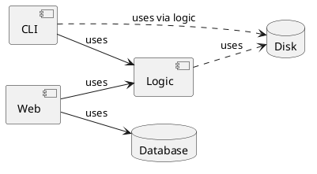

## 🧩 System Architecture Diagram

The `Logic` component provides serialization mechanisms that allow saving the game state to a file, which is used indirectly by the `CLI` component. It is important to note that the `Web` component persists the state using the database — in this case, it does not rely on the serialization mechanisms offered by `Logic`.
