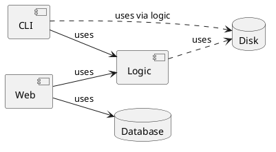

# Schemat blokowy projektu

Komponent `Logic` dostarcza mechanizmów serializacji pozwalających na zapis stanu gry do pliku, co jest wykorzystywane pośrednio przez `CLI`. Należy zwrócić uwagę, że komponent `Web` w celu utrwalenia stanu wykorzystuje bazę danych - w tym przypadku nie korzysta się z mechanizmów serializacji oferowanych przez `Logic`.
