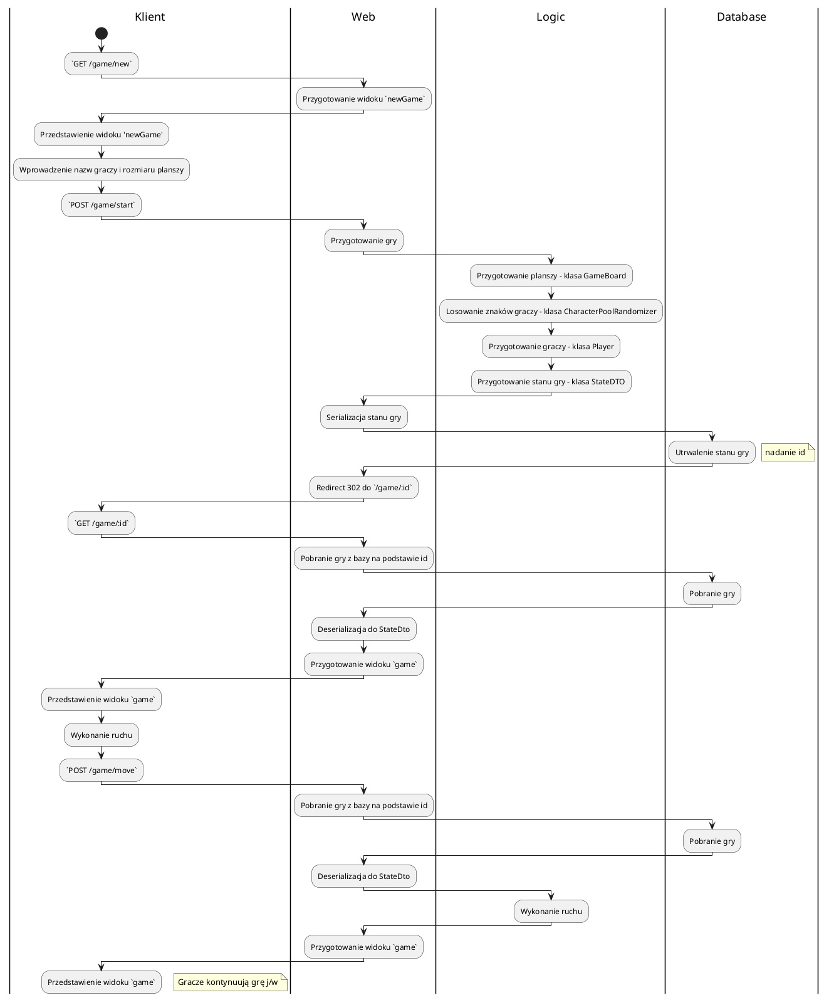

# Główne założenia

Moduł `web` wykorzystuje moduł `logic` w zakresie logiki gry oraz przechowywania stanu gry. W celu utrwalenia stanu (przyjmuje się serializację do JSONa), dodatkowo stosuje się bazę danych PostgreSQL.

# Diagram przepływu

